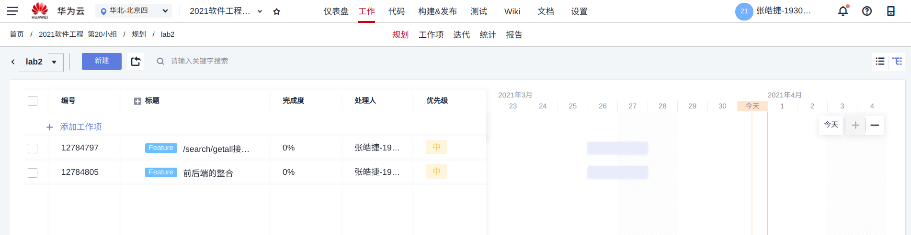
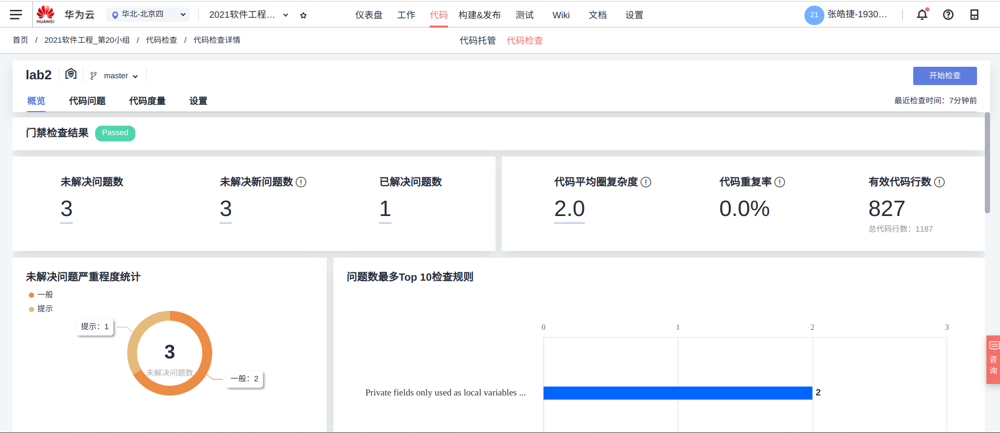
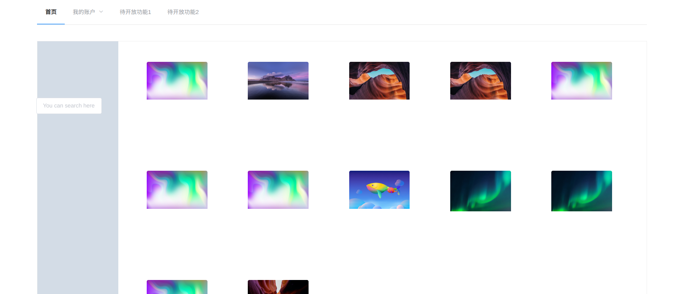
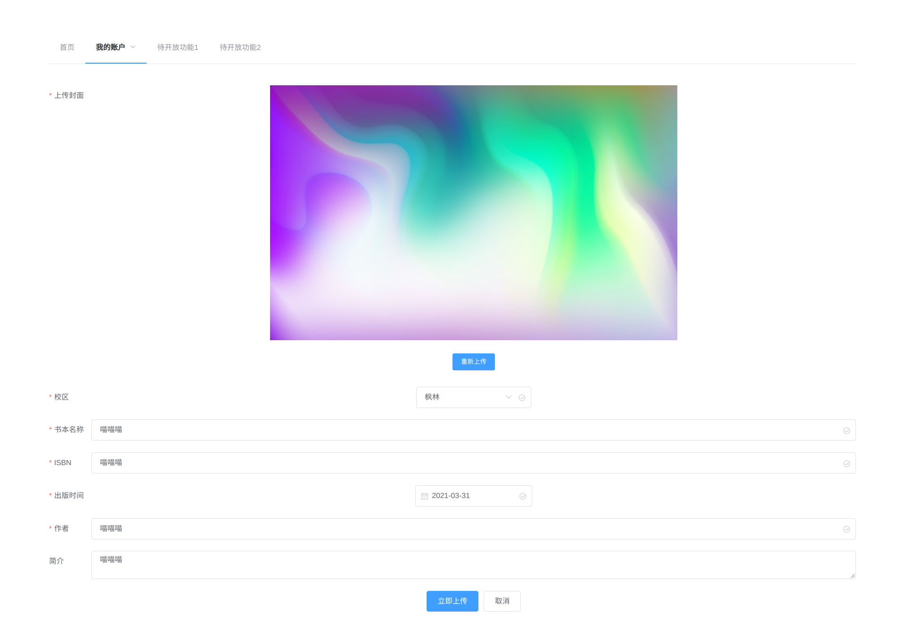
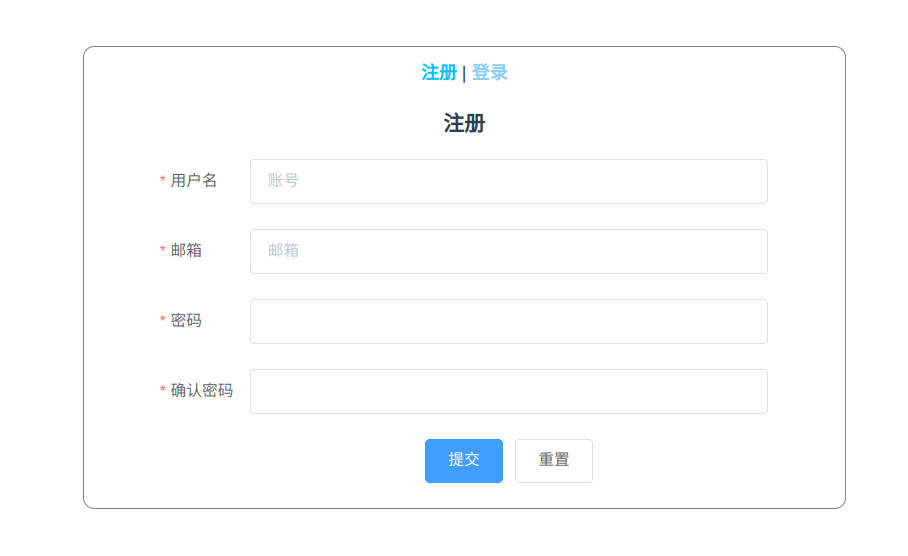

# DevCloud中对于Lab2进⾏项⽬需求规划分配任务的截图

# DevCloud中对于Lab2的项⽬代码使⽤代码检查的检查结果截图

# 项⽬各个⻚⾯的截图

## 展示所有图片的页面

## 上传页面

## 注册页面

## 登录界面

# 每个组员的任务分配情况

后端：张皓捷，朱亦文

前端：项心叶，周思瑜

# ⼩组的实验过程记录，遇到的问题以及解决⽅案

## 实验过程记录

### 后端

2021.3.16：创建了项目，创建了几个实体类，写完了获得数据库内全部图片的接口（支持分页）

2021.3.18：写完了注册接口

2021.3.20：上传接口完成了一半

2021.3.21：完成了登录接口，写完了上传功能，更新了接口。将Book类和BookTDO类分开了

2021.3.21：修正了FileInputStream打开后没有关闭的问题

2021.3.23：把后端项目端口移到了8888,添加了自动登陆功能

2021.3.24：尝试使用jwt+SpringSecurity做鉴权，但是没成功，回滚了

2021.3.26：为/upload/bookupload接口添加了简单的拦截器。如果用户没有登陆会返回403

2021.3.31：前后端上传图片能正常调用了，解决了前后端不能传cookie的问题

### 前端

2021.3.31：改写了上传拦截；更新了logout的前端部分；更新登陆状态显示；前端现在在登录，注册，和上传发生错误的时候可以返回后端的错误信息；更新了store；上传图片能正常处理了；show可以显示图片了

2021.3.30：修改baseURL；更新display页面的img显示；更新了图片展示页面和login页面的逻辑，增加了分页

2021.3.25：完善了login的逻辑

2021.3.22：提交了show和login的初步页面；完善了login的post功能；修改了部分路径错误

2021.3.20：增加了upload的部分信息；部分完善了路由的信息

## 遇到的问题和解决措施

### 后端

中间曾经尝试使用jwt+SpringSecurity进行鉴权，但是由于在学习SpringBootSecurity上遇到了困难，多次调试代码也没有进展，因此放弃了，仓库也回滚了

有一次使用InputStream之后没有正确关闭，在代码质量检查上秒变E。。。。。

之前将实体类和数据传输类都用Book，混合在一起，后来太乱了就将两者分开了。实体类放置在entity的文件夹下，数据传输类归类于dto的文件夹下。

跨域真的很烦

除了以上之外后端接口开发的过程中遇到的问题不是特别大，主要是不知道怎么和前端整合起来

### 前端

上传页面搞了好久，首先开始研究怎么让图片回显，然后研究怎么让图片正确好看地回显，再之后是怎么让图片传输到后端，最后专门在axios.js里面开辟了一个“纯净的”网络请求request，查阅了无数相关资料，终于完成了

经过后端同学的共同调试和无数次console.log，终于确定了后端throw exception传过来的message在哪个object里面，应该用什么样的代码把它alert出来

# 每个⼩组成员单独的实验总结

## 张皓捷的实验总结

终于把lab写完了。第一次做前后端分离的项目，遇到了不少困难，也学到了很多新东西，比如判定用户上传的参数是否合法可以使用一个注解就搞定，而不是像之前一样一个一个手动验证（捂脸）。这次感觉在前后端的交互上还有些卡，之前约定接口的时候有点随意，中途改变了几次接口，下次lab制定接口的时候会和组员一起讨论制定。感谢Spring官网，github，CSDN等等网站上的各种教程。感谢我的组员能和我一起完成这个lab。

## 朱亦文的实验总结

本次lab难度挺大的。由于之前学过一些JavaWeb，所以我就负责了后端。在SpringBoot的学习方面，我搜寻了很多网上教程和b站视频，但总觉得自己学习得还不够系统，资源有些杂乱。jwt鉴权部分一开始是由我负责的，但由于一时还未厘清SpringbootSecurity的工作机制导致拦截器部分的功能依然存在一些漏洞（愧疚），感谢组长及时帮忙做出了补救措施。希望下一次lab能将jwt分支成功合并回来。感谢所有队友给我的帮助！

## 项心叶的实验总结

为了完成这个lab，从b站上找了一个两百多集的视频来看，一开始对vue框架完全不了解，基本上从零学起……结果挑着看了一部分发现还是很多不会，尤其是前后端交互的部分，前端不知道后端如何实现，后端也对前端的代码一无所知，所幸后来是跑通了。作为前端，也学习了不少知识，感谢强大耐心的组长，帮我调试了很多次upload；感谢室友，收集了不少资料。

## 周思瑜的实验总结

从零开始非常困难，经常三天打渔，感谢室友帮我渡过初期极度混沌的阶段。主要是网上资料太多、太杂，无从下手，自己又比较没耐心，耽搁了很久。最重要的还是axios和vuex，这两个由于涉及到参数传递比较繁杂。再次感谢所有队友，尤其是组长，感觉被我逼成了全栈，salute！！！