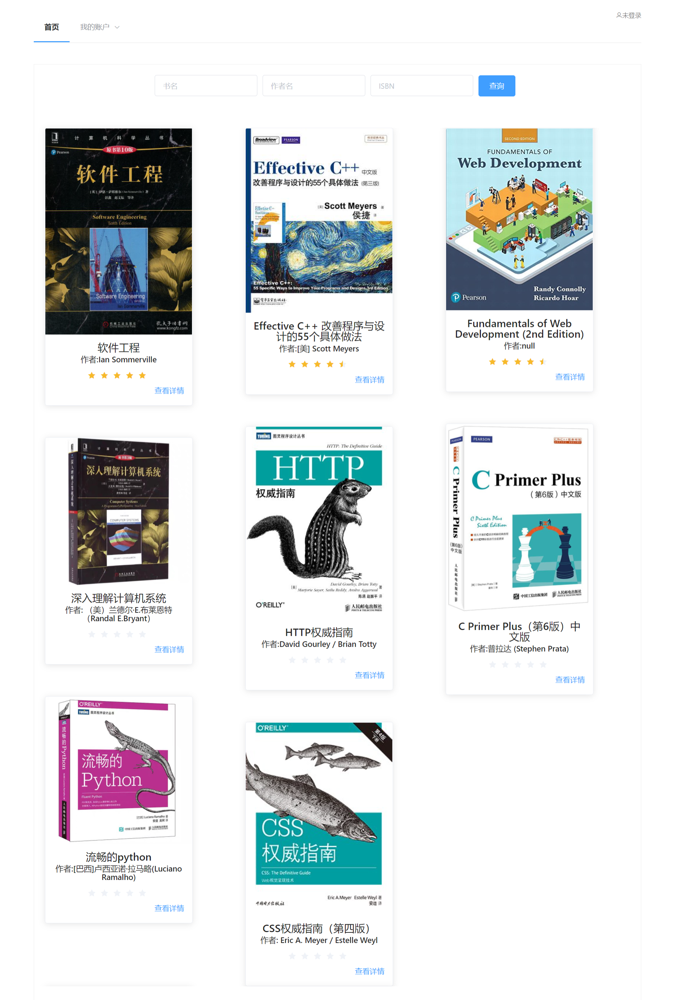
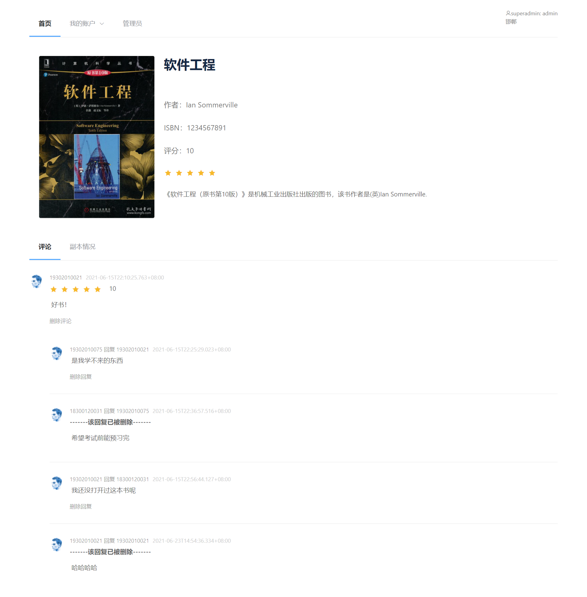

# NorthernLightsLibrary-学校图书管理系统

## 技术栈

本项目是利用SpringBoot+Vue实现的前后端分离的Web版学校图书管理系统。

具体技术栈如下：

后端：SpringBoot、SpringDataJpa、Mysql、Nginx

前端：Vue、ElementUI

## 项目背景和项目功能介绍

### 项目背景

书籍是⼈类宝贵的财富，也是⼈类进步的阶梯。图书馆是⼀个为大家免费提供书籍借阅的地方，但书籍种
类之多，借阅读者数量之多，使得人工管理图书馆在这个信息爆炸的时代变得特别困难，因此就需要图书
馆管理系统的辅助，管理书籍的馆藏状态、读者的借阅状态。
相信⼤家对图书的借阅流程相当熟悉了，让我们⼀起回忆⼀下在复旦图书馆借阅的流程，复旦⼀共有四个
图书馆，教师和学⽣可以跨校区预约借阅图书等，这个过程中涉及的环节就包含着我们的图书馆管理系统
需要实现的功能。

### 系统的用户介绍及用户权限

1. 系统中⼀共有四⼤类⻆⾊，分别是超级管理员（spueradmin）、管理员（admin）、用户（user）和游客（visitor）。
2. 系统自带有一个默认的超级管理员，账号和密码均为admin。登陆后可以修改超级管理员的密码，也能添加新的管理员。添加新的管理员后，默认密码为111111，可自行登录修改。
3. 图书管理员对图书的管理和⽤户的借阅有着最⾼权限，包括对图书的数量、编号、类型、名称等进⾏添
   加、修改、删除管理。同时，图书管理员可对⽤户信息进⾏添加、修改和删除，并对其借阅、归还图书
   等相关功能拥有执⾏权限，还可以添加删除其他的管理员。
4. ⽤户包括教师（teacher）、研究生（postgraduate）、本科生（undergraduate）。教师和学⽣从同样的⼊⼝登录，然后根据⻆⾊有不同的权限，都可以查询、借阅、续借图书，并对图书进⾏收藏、评论、打分等操作。教师和学⽣可以使用学校邮箱注册。
5. 游客不需要登陆，只可以查询浏览图书相关信息，其他任何操作都不允许。

### 系统的主要功能与公众流程

#### 图书管理

图书属性：名称，作者，简介，ISBN，出版时间，封⾯图⽚，本书籍馆藏有⼏本、每本图书馆藏在哪⾥（⼀共有四个图书馆：邯郸，张江，江湾，枫林）。每本书可以有多个副本，每个副本都应该有唯⼀标识；每本书也应该有唯⼀编号。
图书管理员负责对新⼊库书籍的信息录⼊，若该书籍是某些⽤户申请借阅的，会有邮件通知对应⽤户。
图书的数量，编号、类型、名称都由图书管理员负责修改和删除管理。
图书管理员对图书的借阅状态进⾏修改，包括可借阅（available）、已被借阅（borrowed）、已预约（reserved）和已损坏（damaged）。
图书管理员可以对图书所在校区进⾏编辑。

#### 用户管理

⽤户具有借阅书籍的功能。超级管理员可以设定每种类型的用户分别最大可以借阅多少本书和最大借阅时间。

用户具有预约书籍的功能。超级管理员可以设定每种类型的用户最大的预约时间。

每位⽤户都有借书信⽤分，初始状态为满分100分，预约后未在规定时间内借阅、逾期未归还、损坏图书等都将扣除借书信⽤分。

当借书信⽤分低于50分时，⽆法再进⾏书籍的预约。当信用分低于0分时，无法再进行书籍的借阅。必须向管理员赔礼道歉，并让管理员在系统中重置信用，才能恢复使用。

#### 用户借阅流程

1. ⽤户登⼊账号，搜索所需图书。若图书状态显示可借阅，则⽤户可直接去对应的图书馆进⾏借阅，由管理员完成借阅操作。若显示已损坏或⽆法找到该图书，则无法借阅。若显示已被他人预约，也无法借阅
2. 用户可以选择预约图书。被你预约的图书在一段时间内无法被他人借阅。
3. ⽤户需在还书处还书，图书管理员将检查书籍是否被损坏并修改图书状态，若有损坏或丢失将降低⽤户借书信
   ⽤。
4. ⽤户逾期未还图书，则降低借书信⽤，且在信⽤未提升前，⽆法继续借阅其他书籍。


## 环境需求

### 后端运行环境

首先需要自行安装配置openjdk11环境和maven环境。

#### openjdk

```
openjdk version "11" 2018-09-25
OpenJDK Runtime Environment 18.9 (build 11+28)
OpenJDK 64-Bit Server VM 18.9 (build 11+28, mixed mode)
```

#### maven

```
Apache Maven 3.6.3 (cecedd343002696d0abb50b32b541b8a6ba2883f)
Maven home: C:\Program Files\apache-maven-3.6.3\bin\..
Java version: 11, vendor: Oracle Corporation, runtime: D:\jdk-11
Default locale: zh_CN, platform encoding: GBK
OS name: "windows 10", version: "10.0", arch: "amd64", family: "windows"
```

### 前端运行环境

需要自行安装nodejs和npm环境。

### Nginx

需要自行安装Nginx。


## 编译与运行方法

### 后端的编译与运行

**1**.进入

```
NorthernLightsLibrary\backend\src\main\resources
```

打开application.properties文件

**2**.

根据自己机器的实际情况，**自行配置注释中说明了“需自行配置”的条目。**

```
# 数据库url地址，需自行配置
spring.datasource.url=jdbc:mysql://localhost:3306/library_system

#数据库的用户名和密码，需自行配置
spring.datasource.username=root
spring.datasource.password=password
spring.datasource.driverClassName=com.mysql.cj.jdbc.Driver

#上传的书本封面图片的目录，需自行配置
images.whereisbookcovers=/usr/local/bookcovers

#敏感词列表的位置，需自行配置
sensitive.word.list.path=/usr/local/sensitive.txt
```

注：配置完数据库地址后，需要自行在mysql内创建数据库，但表结构不要创建，项目会自动创建。

```
create database library_system
```

**3**.

进入backend目录，使用

```
 mvn clean package '-Dmaven.test.skip=true' -U -e -X -B
```

构建后端项目

**4**.

进入target目录，使用

```
java -jar lab2-0.0.1-SNAPSHOT
```

启动项目。如果成功的话，会发现SpringBoot项目运行在8888端口上了。

### 前端的编译与运行

进入frontend目录。

使用

```
npm run build
```

编译项目。

项目会被打包到frontend的dist目录下。

### nginx的配置

配置nginx配置文件如下

```
server {
        listen       80;
        server_name  127.0.0.1;

        location / {
            root   D:\软件工程\front\NorthernLightsLibrary\frontend\dist;
            index  index.html;
            try_files $uri $uri/ /index.html;
        }

        location ^~/api/ {
           proxy_pass http://127.0.0.1:8888/;
       }
       
       ##注：所有的书本封面的图片前端访问的路径都类似于/image/bookcover/三体.jpg
       ##这里使用nginx进行转发，需要自行配置书本图片存放的真实目录
       ##同时，需要与之前application.properties文件中的images.whereisbookcovers一致。
       location ^~/image/bookcover{
           alias /usr/local/bookcovers;
       }

    }
```

其中，**D:\软件工程\front\NorthernLightsLibrary**这部分需要根据自己项目clone的位置进行修改。


## 项目效果

配置完成，并运行完成后的项目如下






## 贡献者

本项目后端部分由ZHJ，ZYW合作完成

本项目前端部分由XXY，ZSY合作完成

感谢大家的贡献。